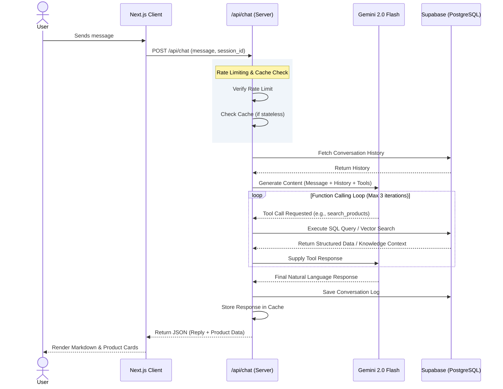

# Radha Bali - AI-Powered Travel Platform

> A comprehensive Bali travel platform featuring a personalized AI chatbot designed to assist users in discovering the best travel packages, powered by Retrieval-Augmented Generation (RAG) and Function Calling.

**Live Demo:** [https://learning-chatbot-orcin.vercel.app/](https://learning-chatbot-orcin.vercel.app/)

---

## 1. Project Overview

Radha Bali is a modern web application built to streamline the travel booking experience. Its core feature is an intelligent conversational agent ("Nusa AI") capable of understanding user preferences, querying a real-time database, and recommending highly tailored travel packages.

## 2. Key Features

- **AI Chat Assistant:** Context-aware conversational agent specialized in Bali tourism.
- **RAG (Retrieval-Augmented Generation):** Contextual answers powered by vector embeddings and `pgvector`.
- **Function Calling:** Seamless integration between the AI model and the PostgreSQL database for real-time product discovery.
- **Dynamic Catalog:** A robust database of over 25 travel packages, activities, and accommodations.
- **Admin Dashboard:** A secure control panel for managing products, knowledge base documents, and monitoring chat logs.
- **Performance Optimization:** Implemented caching strategies and rate limiting to ensure optimal performance and abuse protection.
- **Responsive Architecture:** Fully mobile-optimized interface with a premium, minimalist design system.

## 3. Technology Stack

| Layer | Technology |
|-------|-----------|
| **Framework** | Next.js 15 (App Router) |
| **Language** | TypeScript 5 |
| **AI Model** | Google Gemini 2.0 Flash |
| **Embeddings** | text-embedding-004 (768 dimensions) |
| **Database** | Supabase (PostgreSQL + `pgvector`) |
| **Styling** | Vanilla CSS (Custom Design System) |
| **Deployment** | Vercel |

---

## 4. System Architecture

The architecture of the chatbot relies heavily on a real-time loop of Function Calling between the Next.js server, the Gemini API, and the Supabase PostgreSQL database.

### 4.1 Chatbot Data Flow

Below is the UML Sequence Diagram illustrating the conversational flow and tool execution:



### 4.2 Architectural Components

1. **Rate Limiter & Cache:** Requests are intercepted to prevent abuse and reduce API costs. Frequently asked generic questions are served directly from the cache.
2. **Gemini AI Wrapper:** Manages the communication with the Gemini model, registering three specific tools: `search_products`, `search_knowledge`, and `get_product_detail`.
3. **Tool Handlers:** 
   - `search_products`: Converts AI intents into structured SQL queries to filter products based on price, destination, and duration.
   - `search_knowledge`: Performs semantic similarity searches using `pgvector` to find answers to specific user questions (RAG).
4. **Supabase Database:** Acts as the single source of truth for structured product data, unstructured knowledge base documents, and vector embeddings.

---

## 5. Project Structure

```text
├── scripts/
│   ├── setup-db.sql          # Database schema (run in Supabase SQL Editor)
│   └── seed.ts               # Data seeding script
├── src/
│   ├── app/
│   │   ├── page.tsx          # Landing page
│   │   ├── layout.tsx        # Root layout + SEO
│   │   ├── globals.css       # Core Design System
│   │   ├── admin/            # Secure Admin Panel
│   │   ├── login/            # Admin Authentication Route
│   │   └── api/              # API Routes
│   │       ├── chat/         # Chatbot endpoint (Function calling logic)
│   │       ├── embed/        # Document embedding generation
│   │       ├── products/     # Public product catalog API
│   │       └── admin/        # CRUD operations for Admin Dashboard
│   ├── components/
│   │   └── chat/             # ChatWidget and UI components
│   ├── data/                 # Seed data files
│   └── lib/
│       ├── types.ts          # Global TypeScript interfaces
│       ├── supabase.ts       # Supabase client initialization
│       ├── gemini.ts         # Gemini API integration
│       ├── tools.ts          # Function calling logic
│       └── rate-limit.ts     # Request limiting utilities
```

---

## 6. Getting Started

### 6.1 Prerequisites
- Node.js (v18 or higher)
- Supabase Account
- Google Gemini API Key

### 6.2 Installation
Clone the repository and install the dependencies:
```bash
git clone https://github.com/Vraken9/LearningAI.git
cd LearningAI
npm install
```

### 6.3 Environment Variables
Create a `.env` file in the root directory:
```env
SUPABASE_URL=your_supabase_url
SUPABASE_ANON_KEY=your_anon_key
SUPABASE_SERVICE_ROLE_KEY=your_service_role_key
GEMINI_API_KEY=your_gemini_api_key
ADMIN_PASSWORD=your_secure_admin_password
```

### 6.4 Database Setup & Seeding
1. Open your Supabase Project dashboard and navigate to the **SQL Editor**.
2. Execute the contents of `scripts/setup-db.sql` to generate the schema and enable `pgvector`.
3. Seed the database with initial products and knowledge base documents:
```bash
npx tsx scripts/seed.ts
```

### 6.5 Run Development Server
```bash
npm run dev
```
The application will be accessible at `http://localhost:3000`.

---

## 7. Admin Authentication

The Admin Dashboard is protected by a custom Next.js Middleware utilizing cookie-based authentication.

1. Navigate to `/admin`.
2. Unauthenticated users will be redirected to the `/login` page.
3. Enter the configured `ADMIN_PASSWORD` (defaults to `admin123` if the environment variable is not set).
4. Upon successful authentication, access to the dashboard is granted to manage products and monitor conversation logs.

---

## 8. API Endpoints Reference

| Method | Endpoint | Description |
|--------|----------|-------------|
| `POST` | `/api/chat` | Main conversational endpoint (handles RAG and Function Calling). |
| `POST` | `/api/embed` | Generates vector embeddings for new knowledge base documents. |
| `GET`  | `/api/health` | System health check (Database and AI model availability). |
| `GET`  | `/api/products` | Retrieves product listings with applied filters. |
| `GET`  | `/api/admin/stats` | Retrieves aggregated metrics for the dashboard. |
| `CRUD` | `/api/admin/products` | Product management endpoints. |
| `CRUD` | `/api/admin/documents` | Knowledge base management endpoints. |

---

## 9. Deployment (Vercel)

This project is fully optimized for Vercel deployment without requiring complex build configurations.

1. Push your code to a GitHub repository.
2. In the Vercel Dashboard, select **Add New... > Project**.
3. Import the repository.
4. In the **Environment Variables** section, provide the required keys (`SUPABASE_URL`, `SUPABASE_ANON_KEY`, `SUPABASE_SERVICE_ROLE_KEY`, `GEMINI_API_KEY`, `ADMIN_PASSWORD`).
5. Click **Deploy**. Vercel will automatically handle the build process using `next build`.

---

## 10. License

This project is intended for educational and learning purposes.
